# Исследование и пайплайн прогнозирования временного ряда электропотребления

## 1. Описание временного ряда

Датасет содержит измерения электропотребления и погодных факторов за 2017 год. Целевая переменная проекта - `PowerConsumption_Zone1`. Исходная частота наблюдений - 10 минут. Для моделей прогнозирования ряд агрегируется до почасовой частоты средним значением, потому что это снижает шум, ускоряет расчет и сохраняет ключевую суточную сезонность.

| Показатель                                       | Значение                            |
|:-------------------------------------------------|:------------------------------------|
| Количество строк в исходном 10-минутном датасете | 52 416                              |
| Количество признаков                             | 9                                   |
| Период наблюдений                                | 2017-01-01 00:00 → 2017-12-30 23:50 |
| Частота исходного ряда                           | 10 минут                            |
| Целевой ряд                                      | PowerConsumption_Zone1              |
| Почасовой ряд после resample                     | 8 736 наблюдений, частота 1H        |

Контроль качества данных из исходного ноутбука:

| Проверка                           | Результат            |
|:-----------------------------------|:---------------------|
| Пропуски в исходных колонках       | 0 во всех 9 колонках |
| Дубликаты                          | 0                    |
| Нерегулярные 10-минутные интервалы | 0                    |
| Пропуски в почасовом ряду          | 0                    |

Основные статистики целевого ряда `PowerConsumption_Zone1`:

| Метрика   | PowerConsumption_Zone1   |
|:----------|:-------------------------|
| mean      | 32 344.97                |
| median    | 32 265.92                |
| std       | 7 130.56                 |
| min       | 13 895.70                |
| max       | 52 204.40                |
| skew      | 0.229                    |
| kurt      | -0.754                   |

## 2. Постановка задачи

Задача формулируется как краткосрочное прогнозирование почасового потребления электроэнергии в зоне 1 на горизонт `h=24` часа. Практический смысл такого горизонта - планирование нагрузки на следующий день.

**Тип постановки:** univariate forecasting для `PowerConsumption_Zone1`; внешние погодные признаки использовались в EDA, но итоговый пайплайн строится на лаговых и календарных признаках самого ряда.  
**Режим работы:** offline batch-прогнозирование.  
**Тип модели:** глобальная модель не требуется, потому что в пайплайне прогнозируется один целевой ряд `zone1`; при расширении на несколько зон можно перейти к глобальной ML/DL-модели с `unique_id`.  
**Метрики:** MAE, RMSE, MAPE, sMAPE и Bias. Основная метрика выбора - RMSE, так как она сильнее штрафует крупные промахи в пиковые часы.

## 3. EDA временного ряда

### 3.1 Динамика и распределение

На графиках видно, что ряд не является белым шумом: присутствуют выраженные дневные циклы, недельные эффекты и изменение уровня в течение года. Распределение потребления умеренно асимметрично: skew = 0.229, kurt = -0.754.

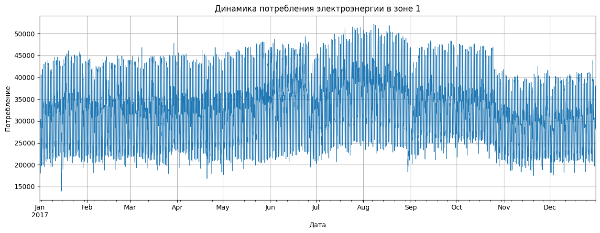

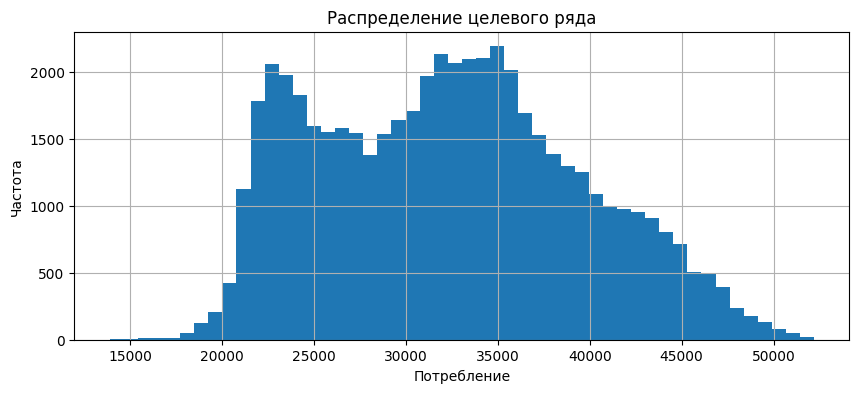

После агрегации до 1 часа сохранена основная структура ряда:

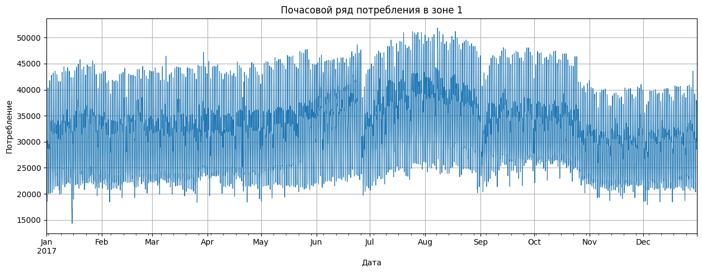

### 3.2 Сезонность и календарные эффекты

Почасовой профиль показывает выраженную внутрисуточную сезонность. Это стало основанием использовать `season_length=24` для статистических моделей и лаги `24`, `48`, `168` для ML-моделей.

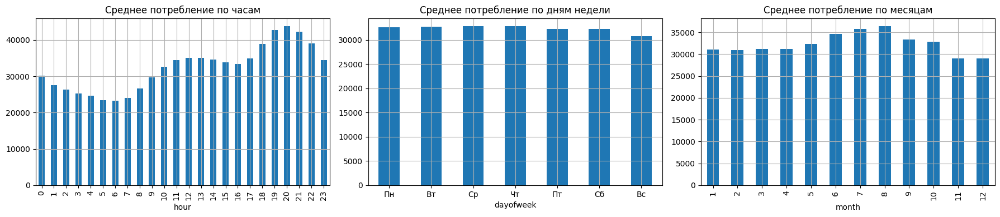

Сезонная декомпозиция подтверждает наличие регулярной суточной компоненты и трендовой составляющей:

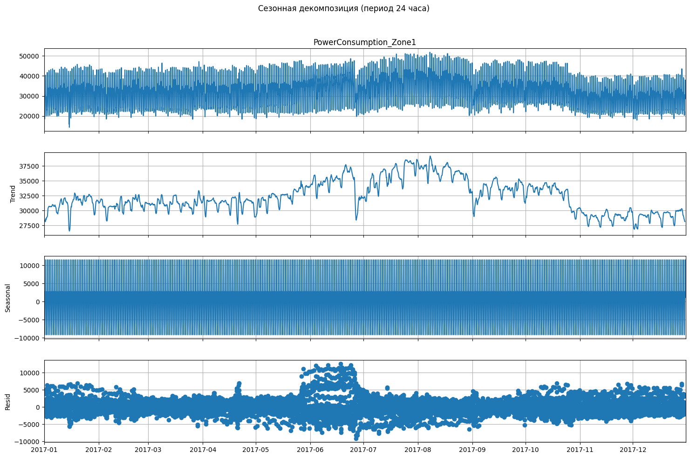

### 3.3 Стационарность

В исходном ноутбуке был применен ADF-тест для почасового ряда и разностей. На уровне 5% стационарность подтверждается уже для исходного почасового ряда, а для первой и сезонной разности результат еще сильнее.

| series        |   adf_stat |   p_value |   stationary_5pct |
|:--------------|-----------:|----------:|------------------:|
| hourly_target |     -4.446 |  0.000246 |                 1 |
| hourly_diff1  |    -21.62  |  0        |                 1 |
| hourly_diff24 |    -18.33  |  2.25e-30 |                 1 |

Вывод: для статистических моделей допустимы как модели с дифференцированием, так и модели, явно учитывающие сезонность. Для ML-моделей достаточно лаговых и календарных признаков без дополнительного сведения к стационарности.

### 3.4 Связь с внешними факторами

EDA показал связь электропотребления с погодными признаками, особенно с температурой и диффузными потоками. В рамках задания №4 итоговый пайплайн оставлен одноцелевым и устойчивым к отсутствию будущих погодных данных; погодные признаки можно добавить как exogenous-регрессоры при наличии прогноза погоды.

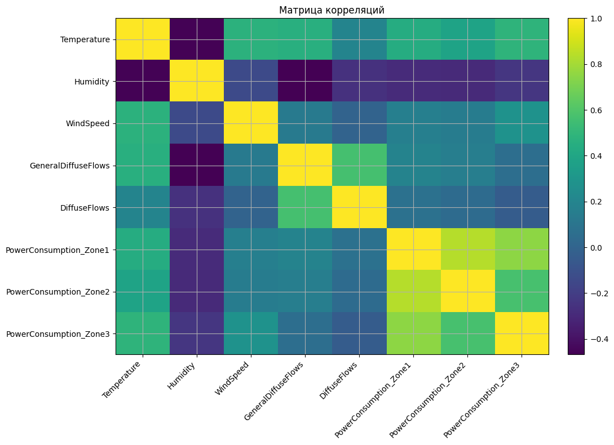

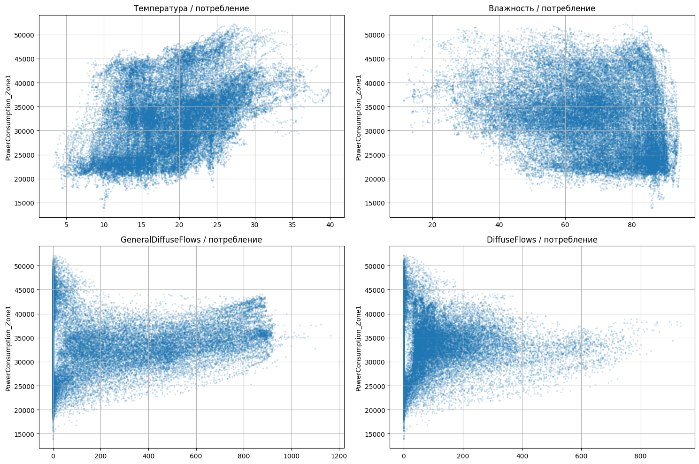

## 4. Анализ аномалий

В исходном ноутбуке сравнивались 3 метода выявления аномалий: rolling z-score, STL robust z-score и IsolationForest.

| Метод              | Параметры                                                                                                                  | Аномалий   | Комментарий                                                                                                                                                        |
|:-------------------|:---------------------------------------------------------------------------------------------------------------------------|:-----------|:-------------------------------------------------------------------------------------------------------------------------------------------------------------------|
| Rolling z-score    | rolling window=24, порог |z|>3                                                                                             | 0          | Метод оказался слишком консервативным: не нашел точек, поэтому не подходит как основной.                                                                           |
| STL robust z-score | STL(period=24, robust=True), robust z через MAD, порог |z|>3.5                                                             | 1 626.00   | Метод слишком чувствителен: помечает около 18.6% ряда, много сезонных/структурных колебаний попадает в аномалии.                                                   |
| IsolationForest    | features=[lag1, lag24, lag168, diff1, hour, dayofweek], contamination=0.02, random_state=42, threshold=0.98 quantile score | 172.00     | Выбран как основной: число аномалий близко к заданной доле 2%, учитывает лаги и календарные признаки, лучше соответствует задаче поиска необычного поведения ряда. |

Итоговый выбор: **IsolationForest**. Rolling z-score не нашел аномалий, поэтому оказался слишком грубым. STL robust z-score нашел 1 626 точек и фактически начал помечать нормальные сезонные колебания как аномалии. IsolationForest с `contamination=0.02` выделил 172 точки, то есть около 2% ряда, и использовал не только уровень потребления, но и лаги, разности и календарный контекст.

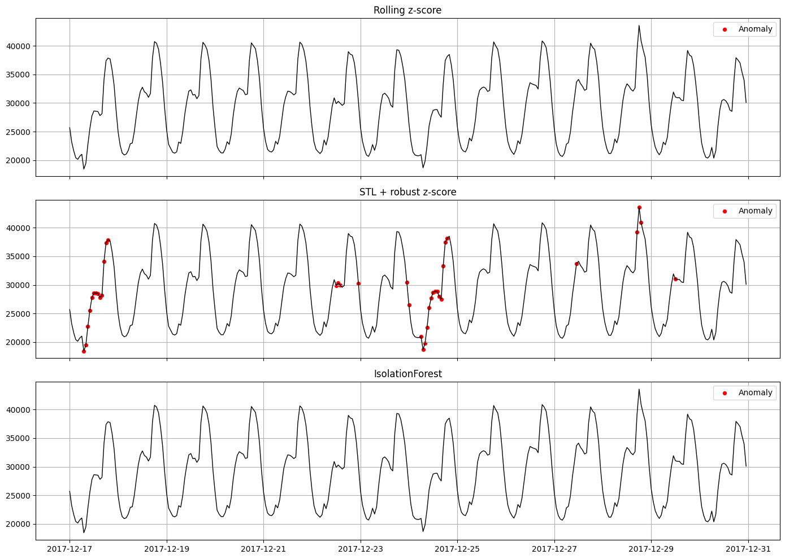

В пайплайне задания №4 дополнительно применен более строгий daily-profile robust z-score для контроля выбросов:

| Метод                        |   Аномалий |   Доля, % |
|:-----------------------------|-----------:|----------:|
| Rolling z-score 24h          |          0 |     0     |
| Daily-profile robust z-score |         99 |     1.133 |

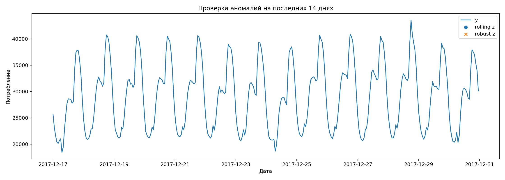

## 5. Таблица выбора методов анализа и прогнозирования ВР

Сравнение моделей собрано из исходного ноутбука. Для статистических моделей использовались rolling backtesting и hold-out. Для ML и DL в исходном ноутбуке приведена hold-out проверка на последнем дне. Горизонт прогноза во всех блоках — `h=24` часа.

| Класс          | Метод            | Параметры / признаки                                                          | CV MAE   | CV RMSE   | CV MAPE, %   | Hold-out MAE   | Hold-out RMSE   |   Hold-out MAPE, % | Комментарий                                                                                                                 |
|:---------------|:-----------------|:------------------------------------------------------------------------------|:---------|:----------|:-------------|:---------------|:----------------|-------------------:|:----------------------------------------------------------------------------------------------------------------------------|
| Baseline       | SeasonalNaive    | season_length=24; повторяет значение того же часа предыдущих суток            | 794.44   | 1 146.63  | 2.561        | 1 087.96       | 1 232.83        |              4.103 | Сильный бейзлайн из-за яркой суточной сезонности; на hold-out лучший среди статистических, но в пайплайне уступил LightGBM. |
| Статистическая | ARIMA            | ручной ARIMA(1,1,1) без сезонной компоненты                                   | 6 773.72 | 8 351.85  | 20.57        | 5 261.95       | 5 962.35        |             18.97  | Плохо описывает суточную сезонность; используется как ручной статистический контроль.                                       |
| Статистическая | AutoARIMA        | автоподбор с season_length=24                                                 | 868.53   | 1 135.46  | 2.751        | 1 491.16       | 1 623.65        |              5.459 | Хорошее качество на CV, но хуже переносится на последний день.                                                              |
| Статистическая | SeasonalES       | alpha=0.8, season_length=24                                                   | 769.03   | 1 090.47  | 2.481        | 1 271.52       | 1 446.69        |              4.669 | Лучшая статистическая модель по CV RMSE; выбрана как статистический кандидат для пайплайна.                                 |
| Статистическая | AutoETS          | автоподбор ETS, season_length=24                                              | 865.33   | 1 104.05  | 2.928        | 1 197.74       | 1 412.07        |              4.184 | Стабильная альтернатива SeasonalES, но CV немного хуже.                                                                     |
| Статистическая | Theta            | season_length=24, additive decomposition                                      | 1 055.36 | 1 311.95  | 3.571        | 2 320.20       | 2 492.32        |              8.58  | Уступает ETS/ARIMA; склонна недоописывать локальные изменения.                                                              |
| Статистическая | AutoTheta        | автоподбор Theta, season_length=24                                            | 1 109.69 | 1 363.60  | 3.736        | 2 253.27       | 2 424.10        |              8.303 | Автоподбор не улучшил результат относительно Theta на hold-out.                                                             |
| ML             | LinearRegression | лаги 1/24/48/168 + rolling mean 24 по лагам 24/168 + hour/dayofweek/month     | —        | —         | —            | 743.02         | 903.75          |              2.634 | Линейный контроль с хорошим MAPE; хуже LightGBM по RMSE.                                                                    |
| ML             | RandomForest     | n_estimators=300, random_state=42, n_jobs=-1, те же лаговые признаки          | —        | —         | —            | 832.00         | 980.52          |              3.012 | Нелинейная модель, но на последнем дне уступила линейной модели и LightGBM.                                                 |
| ML             | LightGBM         | n_estimators=300, learning_rate=0.05, random_state=42, те же лаговые признаки | —        | —         | —            | 730.96         | 863.09          |              2.679 | Лучшая ML-модель по RMSE; выбрана как data-driven кандидат и итоговая модель пайплайна.                                     |
| DL             | RNN              | h=24, input_size=168, max_steps=50                                            | —        | —         | —            | 1 328.11       | 1 471.90        |              4.981 | Лучший DL-вариант в исходном ноутбуке, но хуже ML и статистических кандидатов.                                              |
| DL             | LSTM             | h=24, input_size=168, max_steps=50                                            | —        | —         | —            | 1 488.26       | 1 635.09        |              5.487 | Длинная память не дала выигрыша при ограничении обучения 50 шагами.                                                         |
| DL             | NHITS            | h=24, input_size=168, max_steps=50                                            | —        | —         | —            | 2 694.48       | 3 048.45        |              9.919 | Недообучился/переобобщил на коротком обучении; худший среди DL.                                                             |

### Комментарии по выбору моделей

1. **Baseline.** `SeasonalNaive` выбран как обязательный бейзлайн, потому что у ряда сильная суточная сезонность. Он дает высокое качество без обучения и показывает, насколько сложные модели действительно полезны.
2. **Статистические модели.** `SeasonalES` имеет лучший CV RMSE среди статистических моделей: 1 090.47 против 1 104.05 у AutoETS и 1 135.46 у AutoARIMA. Поэтому именно `SeasonalES` взят в задание №4 как лучший статистический кандидат. При этом на одном hold-out окне `SeasonalNaive` оказался лучше, что говорит о необходимости rolling backtesting, а не выбора по одному разрезу.
3. **ML-модели.** `LightGBM` имеет лучший hold-out RMSE среди ML-моделей: 863.09. Параметры `n_estimators=300` и `learning_rate=0.05` дают умеренный бустинг без чрезмерно долгого обучения; лаги `1/24/48/168` кодируют краткосрочную, суточную, двухсуточную и недельную зависимость.
4. **DL-модели.** Из DL лучше всего сработал `RNN`, но его RMSE = 1 471.90, что хуже LightGBM и статистических кандидатов. Основная причина — ограниченное обучение `max_steps=50` и сравнительно небольшой одномерный ряд, где табличные лаговые признаки дают более устойчивый результат.

Графики прогнозов лучших моделей из исходного ноутбука:

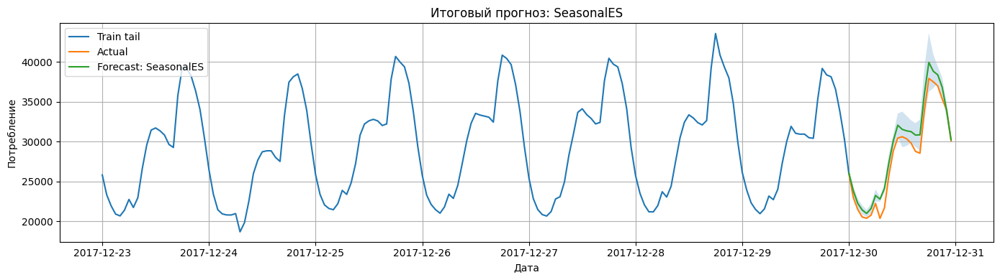

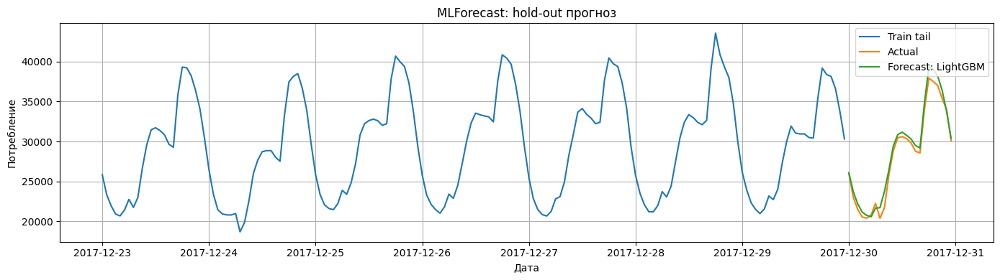

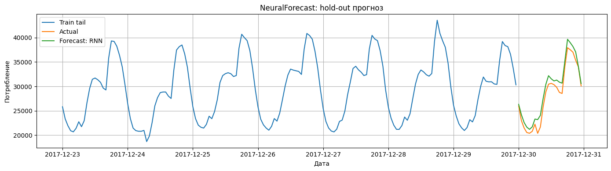

## 6. Пайплайн решения задачи прогнозирования ВР

Пайплайн задания №4 построен как воспроизводимый offline-процесс:

1. Загрузка `powerconsumption.csv`.
2. Преобразование `Datetime` в `datetime`, сортировка, удаление дублей.
3. Агрегация `PowerConsumption_Zone1` до почасовой частоты средним.
4. Контроль качества: количество строк, пропуски, дубликаты, регулярность временной сетки.
5. Формирование признаков для ML: лаги `1, 2, 3, 24, 25, 48, 72, 168`, скользящие средние и стандартные отклонения `24/168`, календарные признаки, синус/косинус часа и дня недели.
6. Rolling backtesting: `3` окна, горизонт `24` часа, максимальный train size `2160` часов.
7. Сравнение кандидатов: `SeasonalNaive`, `SeasonalES`, `LinearRegression`, `RandomForest`, `LightGBM`.
8. Выбор лучшей модели по среднему RMSE на backtesting.
9. Финальная hold-out проверка, анализ остатков, статистические тесты и тест производительности.

Конфигурация пайплайна:

| Параметр                       | Значение               |
|:-------------------------------|:-----------------------|
| target                         | PowerConsumption_Zone1 |
| resample_frequency             | 1H mean                |
| horizon_hours                  | 24                     |
| season_length_hours            | 24                     |
| n_backtesting_windows          | 3                      |
| max_train_size_hours           | 2160                   |
| selected_from_task2            | SeasonalES             |
| selected_from_task3            | LightGBM               |
| final_best_by_backtesting_rmse | LightGBM               |

Контроль качества входных данных пайплайна:

| Проверка                   |   Значение |
|:---------------------------|-----------:|
| rows_10min_raw             |      52416 |
| rows_hourly                |       8736 |
| missing_y_hourly           |          0 |
| duplicates_raw_after_clean |          0 |
| freq_hourly_regular        |       True |

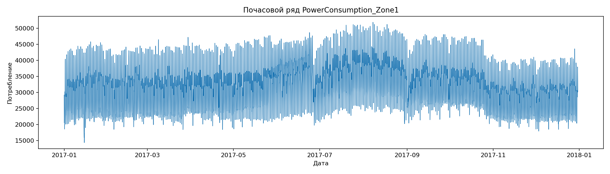

## 7. Результаты тестирования пайплайна

### 7.1 Rolling backtesting и скорость

Итоговая таблица по rolling backtesting показывает, что **LightGBM** имеет минимальный средний RMSE = 838.16 и MAPE = 2.03%. При этом время обучения остается умеренным: около 0.65 сек на окно, что приемлемо для offline batch-пайплайна.

| Модель           | MAE      | RMSE     |   MAPE, % |   sMAPE, % |   Bias |   Fit, sec mean |   Predict, sec mean |
|:-----------------|:---------|:---------|----------:|-----------:|-------:|----------------:|--------------------:|
| LightGBM         | 620.93   | 838.16   |     2.028 |      2.03  | -44.7  |        0.651    |            0.262    |
| RandomForest     | 705.78   | 985.35   |     2.277 |      2.26  | 161.1  |        1.027    |            0.401    |
| LinearRegression | 751.14   | 998.67   |     2.495 |      2.469 | 234.04 |        0.017    |            0.277    |
| SeasonalNaive    | 1 001.13 | 1 275.12 |     3.373 |      3.307 | 607.1  |        1.07e-06 |            0.000938 |
| SeasonalES       | 1 030.49 | 1 295.29 |     3.455 |      3.383 | 649.59 |        0.0011   |            0.000647 |

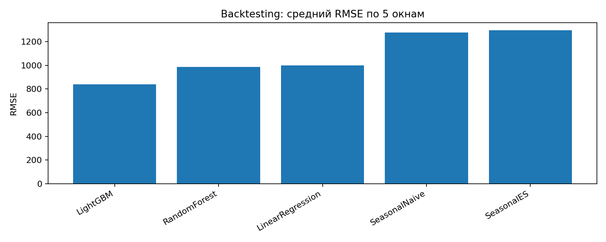

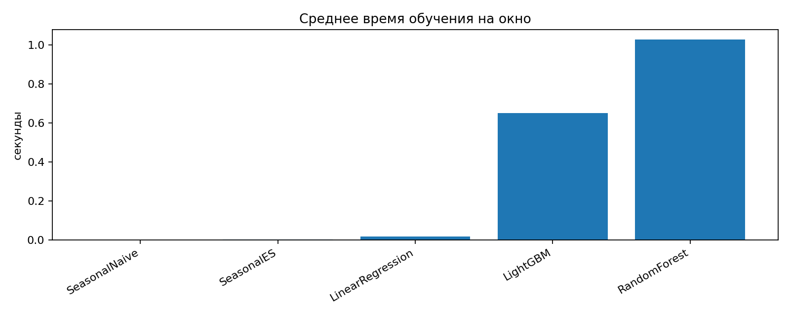

### 7.2 Hold-out тест

На последнем 24-часовом окне LightGBM также остается лучшей моделью: RMSE = 828.39, MAPE = 2.43%. Это подтверждает выбор модели по rolling backtesting.

| Модель           |   Fit, sec |   Predict, sec | MAE      | RMSE     |   MAPE, % |   sMAPE, % | Bias     |
|:-----------------|-----------:|---------------:|:---------|:---------|----------:|-----------:|:---------|
| LightGBM         |   0.583    |       0.267    | 680.91   | 828.39   |     2.433 |      2.406 | 397.67   |
| RandomForest     |   1.061    |       0.388    | 899.67   | 1 085.64 |     3.135 |      3.07  | 865.30   |
| LinearRegression |   0.02     |       0.279    | 1 013.69 | 1 181.29 |     3.677 |      3.584 | 998.23   |
| SeasonalNaive    |   5.14e-07 |       0.00214  | 1 087.96 | 1 232.83 |     4.103 |      3.989 | 1 063.96 |
| SeasonalES       |   0.00189  |       0.000904 | 1 271.52 | 1 446.69 |     4.669 |      4.527 | 1 263.05 |

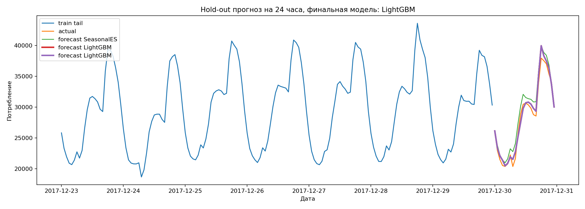

### 7.3 Анализ остатков и статистические тесты

Остатки финальной модели имеют среднее смещение 397.67 на hold-out. Jarque-Bera не отвергает нормальность остатков, но Ljung-Box показывает статистически значимую автокорреляцию. Это означает, что LightGBM хорошо решает основную задачу, но в ряду остается часть временной структуры, которую можно дополнительно доработать через расширение лагов, признаки праздников или exogenous-признаки.

| Тест                                       |   Статистика |   p-value | Интерпретация                                                                                                    |
|:-------------------------------------------|-------------:|----------:|:-----------------------------------------------------------------------------------------------------------------|
| Ljung-Box residual autocorrelation         |       20.88  |  0.0219   | p<0.05: у остатков есть статистически значимая автокорреляция; модель не полностью исчерпала временную структуру |
| Jarque-Bera residual normality             |        0.352 |  0.838    | p>0.05: нормальность остатков не отвергается                                                                     |
| ADF residual stationarity                  |       -2.578 |  0.0976   | p≈0.098: стационарность остатков не подтверждена на 5%, но близка к 10% уровню                                   |
| Wilcoxon |error|: LightGBM < SeasonalES    |      450     |  6.22e-07 | p<0.05: абсолютные ошибки LightGBM статистически ниже ошибок сравниваемой модели                                 |
| Wilcoxon |error|: LightGBM < SeasonalNaive |      489     |  1.83e-06 | p<0.05: абсолютные ошибки LightGBM статистически ниже ошибок сравниваемой модели                                 |

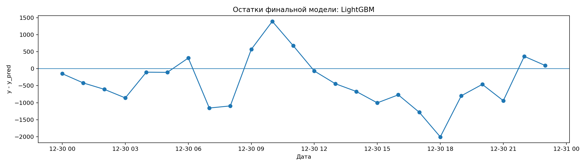

## 8. Итоговый выбор и выводы

Итоговая модель пайплайна — **LightGBM**.

Обоснование выбора:

- среди ML-моделей в исходном ноутбуке LightGBM дал лучший RMSE на hold-out: 863.09;
- LightGBM показал лучший средний backtesting RMSE: 838.16;
- на финальном hold-out LightGBM также лучший: RMSE = 828.39, MAPE = 2.43%;
- Wilcoxon-тест показал, что абсолютные ошибки LightGBM статистически ниже ошибок `SeasonalES` и `SeasonalNaive`;
- скорость обучения и прогноза подходит для offline-пайплайна: примерно 0.65 сек обучения и 0.26 сек предсказания на окно.

Ограничения и направления улучшения:

1. В остатках сохраняется автокорреляция, поэтому можно добавить больше лагов, признаки праздников и специальные признаки пиковых часов.
2. Погодные признаки не включены в итоговый пайплайн, потому что для будущего горизонта нужны прогнозы погоды; при наличии таких данных они могут повысить качество.
3. DL-модели обучались ограниченное число шагов; при более длительном обучении и подборе гиперпараметров их качество может улучшиться, но в текущем проекте LightGBM заметно надежнее и быстрее.
4. Для промышленного использования нужно добавить мониторинг drift, регулярное переобучение и логирование прогнозов/ошибок.
